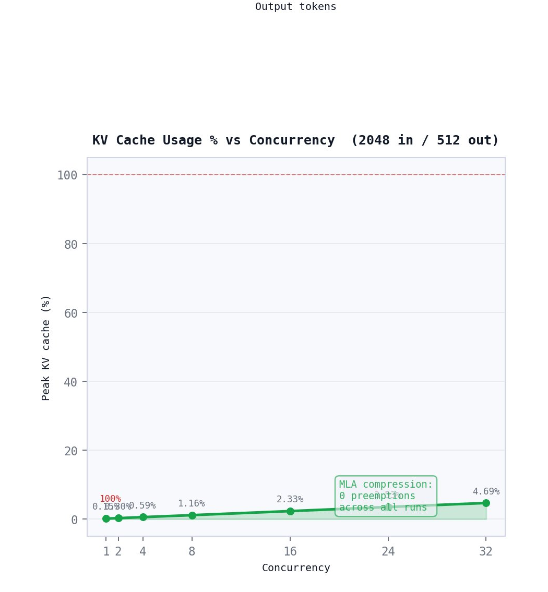
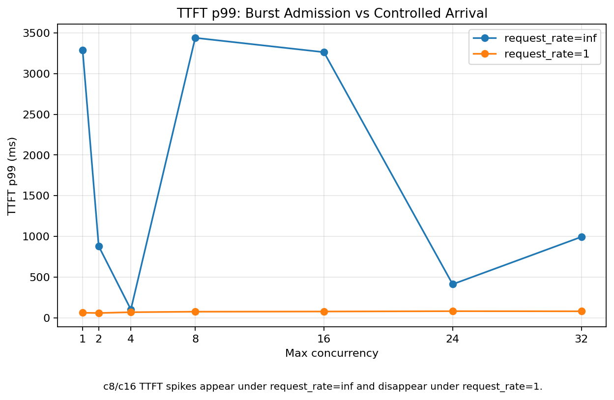

# LLM Systems Engineering Lab

A hands-on inference engineering lab for understanding modern LLM serving from the runtime layer down to the GPU and up to traffic admission.

This is not a "which GPU is faster?" benchmark. The goal is a practical, evidence-driven playbook for frontier serving architectures: **MoE**, **MLA**, **vLLM V1**, **KV-cache residency**, **prefill/decode behavior**, **scheduler pressure**, and **traffic-shape sensitivity**.

| Run | Hardware | Models | Engine | Main Artifact |
|---|---|---|---|---|
| Build 001 | RTX PRO 6000 · 96 GB VRAM | Dense model baseline | vLLM | Baseline TTFT / TPOT / throughput |
| Build 002 | RTX PRO 6000 · 96 GB VRAM · 11 vCPU | DeepSeek-V2-Lite-Chat (MoE + MLA) | vLLM V1 | 4 tracks · prefill, decode, KV residency, request-rate |

---

## 1. Why this repo exists

Most LLM inference writeups over-focus on GPU utilization or tokens/second. That misses the real systems problem.

An inference node is a balanced ecosystem:

| Layer | Why It Matters |
|---|---|
| Model architecture | MoE changes active compute; MLA changes KV-cache residency |
| Runtime | vLLM scheduling and batching decide how requests share the backend |
| KV cache | Long-lived decode sequences consume memory across iterations |
| Traffic shape | Burst and steady arrival can produce very different TTFT behavior |
| Host CPU | API serving, tokenization, async runtime, metrics, and benchmark clients are not free |
| GPU | Executes model work, but is only one part of the serving node |

The serving stack that connects them:

```
model architecture
  ↓
attention / KV-cache design
  ↓
serving runtime
  ↓
scheduler and batching policy
  ↓
request arrival pattern
  ↓
host CPU + GPU execution
  ↓
TTFT / TPOT / throughput / failures
```

This lab exists to make those layers visible and answerable:

- Why does TTFT spike?
- When does TPOT degrade?
- Is the backend compute-bound, memory-bound, scheduler-bound, or admission-bound?
- When does KV-cache residency become the limiting factor?
- How do modern architectures like MoE + MLA change the expected bottleneck?
- What should a production router, scheduler, or Kubernetes control plane actually watch?

---

## 2. Core thesis

In older dense-model mental models, the expected failure path is:

```
concurrency ↑
  → resident sequences ↑
  → KV cache usage ↑
  → memory pressure ↑
  → waiting / preemption / OOM
  → latency collapse
```

With modern architectures such as **MoE + MLA**, that pattern changes. MLA reduces KV-cache residency. MoE changes the active compute path. vLLM V1 changes scheduling and batching behavior. Traffic shape changes how pressure appears at the backend.

The real question becomes:

> If KV cache is no longer the first bottleneck, where does the bottleneck move?

**Build 002 answered that question in one concrete setup: KV-cache pressure did not appear. Burst-admission behavior did.**

---

## 3. Build progress

| Build | Focus | Architecture / Runtime | Status | Main Artifact |
|---|---|---|---|---|
| Build 001 | vLLM performance triage | Dense model baseline | Complete | TTFT / TPOT / throughput baseline |
| Build 002 | Modern vLLM V1 baseline | DeepSeek-V2-Lite-Chat · MoE + MLA · vLLM V1 | Complete | Prefill, decode, KV residency, request-rate comparison |
| Build 003 | Scheduler and admission tuning | vLLM V1 knobs | Planned | `max_num_batched_tokens`, `max_num_seqs`, admission policy |
| Build 004 | Runtime-aware routing | Backend-state-aware routing | Planned | Routing rules based on TTFT, queueing, KV, and decode state |

---

## 4. Build 001 — vLLM performance triage

Build 001 established the first serving baseline. The goal was to learn how to measure basic inference health before making deeper claims.

**Measured:** TTFT, TPOT / ITL, request throughput, output token throughput, workload-shape sensitivity, failure modes, operational decision rules.

**Build 001 answered:**

> How do I know when a vLLM backend is healthy, saturated, or failing?

**Artifacts:**

```
docs/builds/001-vllm-performance-triage/
results/processed/001-vllm-performance-triage/
```

---

## 5. Build 002 — modern vLLM V1 baseline

### 5.1 Target stack

| Component | Value |
|---|---|
| Model | `deepseek-ai/DeepSeek-V2-Lite-Chat` |
| Architecture | MoE + MLA |
| Runtime | vLLM V1 |
| GPU | RTX PRO 6000 |
| VRAM | 96 GB |
| Host RAM | 56 GB |
| vCPU | 11 |
| Provider | CloudRift AI |

### 5.2 Experiment tracks

| Track | Name | Question |
|---|---|---|
| T0 | Runtime baseline | Is the server healthy before stress? |
| T1 | Prefill / context stretch | Does longer context primarily affect TTFT or TPOT? |
| T2 | Decode residency ramp | Does longer output degrade token smoothness? |
| T3 | KV / concurrency ramp | Does higher concurrency trigger KV pressure or preemption? |
| T4 | request_rate repeatability | Was the c8/c16 TTFT inversion burst-admission behavior? |

### 5.3 Headline finding

The expected failure mode was KV-cache pressure. That did not happen.

```
Peak KV-cache usage    < 5%
Preemptions            0
Waiting                0
Failed requests        0
```

The surprising behavior appeared under traffic shape. At `request_rate=inf`, c8/c16 concurrency produced multi-second TTFT spikes. At `request_rate=1`, the same concurrency ramp normalized completely.

| Concurrency | TTFT p99 · `request_rate=inf` | TTFT p99 · `request_rate=1` | Interpretation |
|---:|---:|---:|---|
| 8 | 3439.63 ms | 73.77 ms | Burst-admission artifact |
| 16 | 3263.37 ms | 76.25 ms | Burst-admission artifact |

**The systems lesson:** MoE + MLA changed the bottleneck. KV residency stayed low, so the bottleneck moved upward into request admission, scheduler/runtime behavior, and node balance not GPU memory.

#### KV cache was not the bottleneck



Peak KV-cache usage stayed below 5% across the tested concurrency ramp. Preemptions, waiting requests, and failed requests stayed at zero.

#### Traffic shape changed TTFT



The c8/c16 TTFT spikes appeared under `request_rate=inf` and disappeared under `request_rate=1`. Same model, same GPU, same input/output shape, different arrival pattern.


**Deployment implication.** Serving teams should not assume concurrency pressure will immediately appear as KV-cache exhaustion with modern MoE + MLA architectures. The first failure signal may be TTFT sensitivity to burst traffic shape, not memory pressure. Monitor scheduler queue depth and request admission patterns, not just GPU memory utilization.

### 5.4 Artifacts

```
docs/builds/002-modern-vllm-v1-baseline/README.md
docs/builds/002-modern-vllm-v1-baseline/setup.md
docs/builds/002-modern-vllm-v1-baseline/results-summary.md
docs/builds/002-modern-vllm-v1-baseline/findings.md
docs/builds/002-modern-vllm-v1-baseline/cloudrift-rate1-repeatability.md
```

---

## 6. What Build 002 teaches

### `request_rate=inf` and `request_rate=1` are different systems tests

`request_rate=inf` is a burst/saturation probe. It answers: *What happens when the client pushes as fast as possible, bounded by max concurrency?*

`request_rate=1` is a controlled-arrival probe. It answers: *What happens when requests arrive at a bounded rate?*

Both are useful. They answer different questions. Build 002 used both because the c8/c16 TTFT inversion needed attribution before it could be explained.

**Deployment implication.** Load testing with `request_rate=inf` only will not tell you whether TTFT spikes are KV-cache pressure or burst-admission behavior. Change one variable — arrival rate — and watch whether the spike disappears. That is the attribution test.

### A benchmark is an argument about causality

The first run showed TTFT spikes. A weak conclusion would have been: *The GPU saturated.* The evidence disagreed:

```
KV cache < 5%
preemptions = 0
waiting = 0
failed requests = 0
```

Build 002 changed one variable: request arrival rate. When the spikes disappeared under `request_rate=1`, the conclusion became attributable: the c8/c16 inversion was burst-admission behavior, not KV-cache pressure or stable GPU saturation.

### Host CPU is part of the inference node

The Build 002 VM had a powerful GPU but only 11 vCPUs. That matters because the host participates in API serving, tokenization, async runtime coordination, the scheduler loop, metrics scraping, and benchmark client execution. The GPU was not the only relevant resource.

**Deployment implication.** Inference node sizing decisions that optimize VRAM alone will miss host CPU as a constraint. On vCPU-constrained nodes, the scheduler loop and API serving overhead may appear as TTFT instability before GPU memory pressure does.

---

## 7. Headline numbers

| Metric | Value | Where |
|---|---|---|
| Peak KV-cache usage under c16 concurrency | **< 5 %** | Build 002 · T3 |
| Preemptions across all tracks | **0** | Build 002 · all tracks |
| TTFT p99 spike at `request_rate=inf` · c8 | **3439.63 ms** | Build 002 · T4 |
| TTFT p99 normalized at `request_rate=1` · c8 | **73.77 ms** | Build 002 · T4 |
| TTFT spike reduction on arrival-rate change | **~47×** | Build 002 · T4 |
| Failed requests across all tracks | **0** | Build 002 · all tracks |

---

## 8. Planned Build 003

Build 003 starts from the Build 002 finding: KV pressure did not appear; burst admission did. Build 003 focuses on scheduler and admission controls before chasing memory fixes.

> **Read this first**: the Build 002 finding was observed on one specific node shape (11 vCPU, 96 GB VRAM, single GPU, CloudRift). Hardware and traffic mix will shift these results. Re-run on your own node before committing to a deployment configuration.

**Planned knobs:**

| Priority | Knob | Question |
|---:|---|---|
| 1 | `max_num_batched_tokens` | Can scheduler token budget reduce TTFT spikes without hurting TPOT? |
| 2 | `max_num_seqs` | Can sequence limits reduce burst amplification? |
| 3 | router-side concurrency cap | Can upstream admission prevent pathological burst behavior? |
| 4 | finite request-rate policy | What arrival rate keeps TTFT within target bounds? |
| 5 | repeat trials | Are improvements stable or noisy? |

**Build 003 question:**

> Given a fixed inference node shape, which scheduler and admission knobs improve the TTFT / TPOT / throughput tradeoff?

---

## 9. Quick start

```bash
# Reproduce processed results and findings from existing data
git clone <this-repo>
cd llm-systems-lab

# Review processed results
ls results/processed/002-modern-vllm-v1-baseline/

# Re-run Build 002 on your own GPU node
bash scripts/run_server_build_002.sh
bash scripts/run_benchmark_build_002.sh
bash scripts/scrape_vllm_metrics.sh
python3 scripts/summarize_build_002.py
```

Full methodology and setup in [`docs/builds/002-modern-vllm-v1-baseline/setup.md`](docs/builds/002-modern-vllm-v1-baseline/setup.md).

---

## 10. Repository layout

```
configs/
├── models/                             ← model configs per build
└── workloads/                          ← benchmark workload definitions

docs/
└── builds/
    ├── 001-vllm-performance-triage/    ← Build 001 methodology and findings
    └── 002-modern-vllm-v1-baseline/
        ├── README.md                   ← build overview
        ├── setup.md                    ← reproducibility: hardware, env, launch
        ├── results-summary.md          ← processed tables per track
        ├── findings.md                 ← engineering interpretation
        └── cloudrift-rate1-repeatability.md  ← T4 attribution evidence

results/
└── processed/
    ├── 001-vllm-performance-triage/    ← Build 001 processed outputs
    └── 002-modern-vllm-v1-baseline/    ← Build 002 processed outputs
|___plots                               ← Images matplotlib graphs

scripts/
├── run_server_build_002.sh             ← launch vLLM server for Build 002
├── run_benchmark_build_002.sh          ← run benchmark sweep
├── scrape_vllm_metrics.sh              ← scrape Prometheus metrics during run
└── summarize_build_002.py              ← aggregate raw results → processed tables
```

Raw benchmark data is intentionally not kept in `main`. Experiment branches preserve raw evidence where needed.

---

## 11. Reproducibility 

| Artifact Type | Purpose | Kept in `main`? |
|---|---|---|
| Raw logs | Full experiment evidence | No — experiment branches |
| Processed results | Tables and summaries | Yes |
| Findings | Engineering interpretation | Yes |
| Scripts | Reproduce and summarize runs | Yes |
| Scratch helpers | One-off local analysis | No |

---

## 12. Engineering principles

**1. Separate measurement from tuning.**
Build 002 measured behavior. Build 003 will tune knobs. Mixing both in one build destroys attribution.

**2. Do not claim GPU saturation without evidence.**
Look for KV usage, waiting, preemptions, failures, TTFT, TPOT, and throughput together. Any one metric alone is insufficient.

**3. Treat traffic shape as a first-class variable.**
Burst arrival and steady arrival can produce completely different latency profiles on the same hardware with the same model.

**4. Use mechanism tables, not just benchmark tables.**
The goal is to explain *why* the system behaved that way, not just report that it did.

**5. Do not hide hardware constraints.**
vCPU count, host RAM, runtime version, and benchmark client placement matter and belong in every result.

---

## 13. Citing

If you use these results, please cite the run fingerprint:

```
LLM Systems Engineering Lab · Build 002
RTX PRO 6000 · 96 GB VRAM · 11 vCPU · CloudRift
DeepSeek-V2-Lite-Chat · MoE + MLA · vLLM V1
4 experiment tracks
```

---

## 14. References

- https://www.yottalabs.ai/post/how-llm-inference-systems-actually-run-in-production-architecture-explained
- https://docs.vllm.ai/en/stable/usage/metrics/
- https://research.ibm.com/publications/scalable-and-efficient-llm-serving-with-the-vllm-production-stack
- https://github.com/vllm-project/production-stack
- https://github.com/vllm-project/production-stack/blob/main/tutorials/00-install-kubernetes-env.md
- https://developers.redhat.com/articles/2025/05/20/llm-d-kubernetes-native-distributed-inferencing
- https://huggingface.co/deepseek-ai/DeepSeek-V2-Lite-Chat - excellent architecture breakdown for MOE + MLA 
- https://arxiv.org/abs/2309.06180
- https://arxiv.org/abs/2405.04434
- https://arxiv.org/abs/2211.15841
- vLLM Production Metrics — KV-cache usage, request state, and preemption metrics.
- vLLM PagedAttention paper — KV-cache memory and batching/concurrency reasoning.
- vLLM Optimization and Tuning — chunked prefill and prefill/decode scheduling behavior.
- vLLM Automatic Prefix Caching — repeated-prefix workload behavior.
- Red Hat: 5 steps to triage vLLM performance — Framework Build as performance triage.
  


