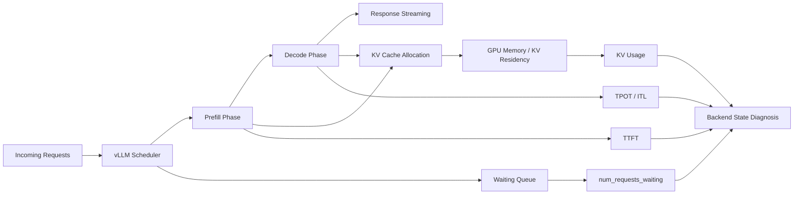
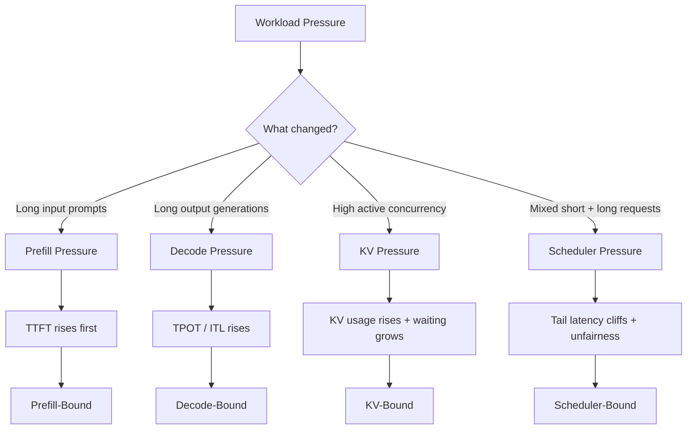
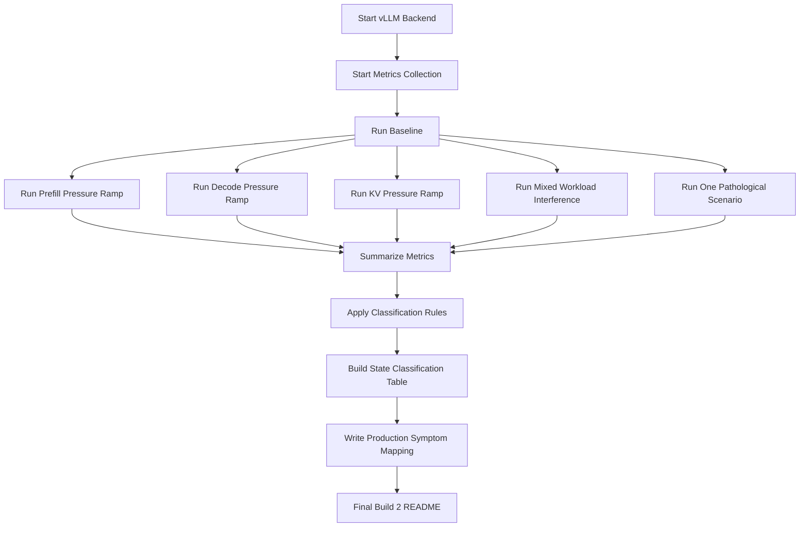
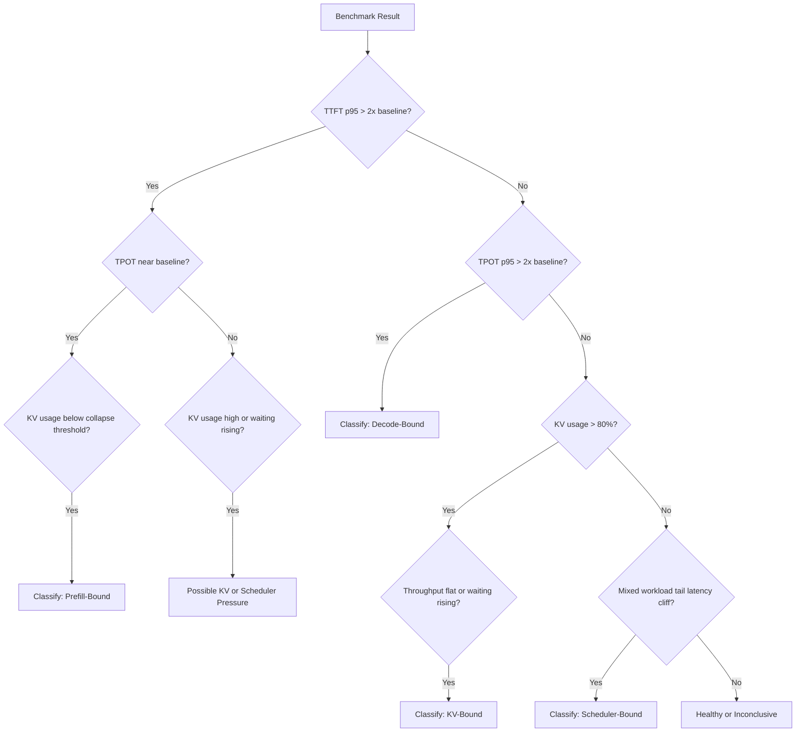
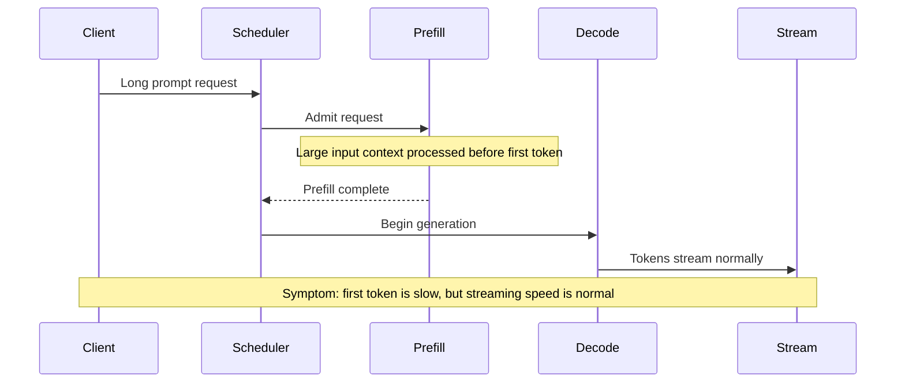
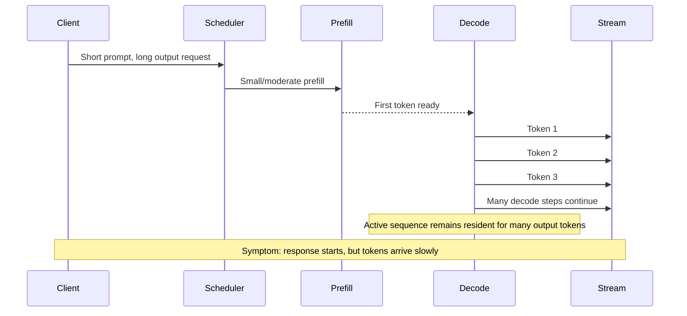
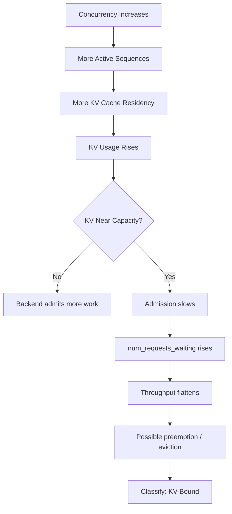
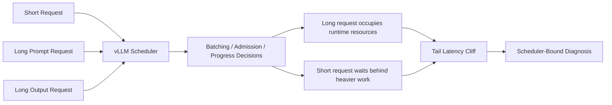
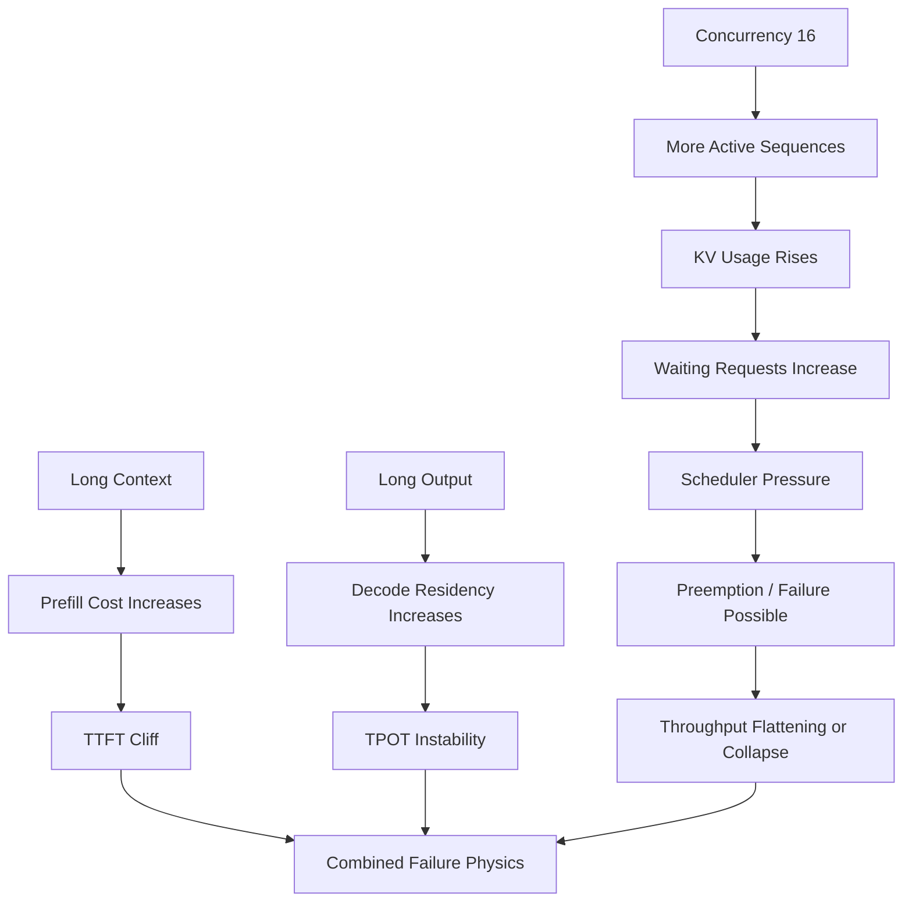
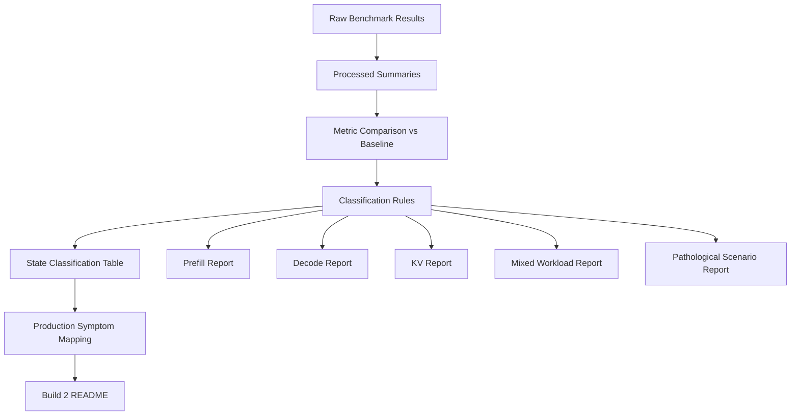

# Build 2 — Prefill, Decode, and KV Behavior

## Objective

Build 2 explains why LLM inference backends behave the way they do under workload pressure.

Build 1 measured baseline serving behavior:

* TTFT
* TPOT / ITL
* Throughput
* GPU memory
* KV usage
* Saturation points

Build 2 moves one layer deeper.

The goal is not to tune the backend yet. The goal is to build a diagnostic model that explains which system state the backend enters, why it enters that state, and which metrics reveal the transition.

Build 2 is complete when raw benchmark metrics can be converted into an operational diagnosis.

---

## Core Question

When latency or throughput degrades, what state is the backend in, and why?

Every experiment must classify the backend into one of four states:

1. Prefill-bound
2. Decode-bound
3. KV-bound
4. Scheduler-bound

This classification is the central artifact of Build 2.

---

# 1. Build 2 Mental Model



### How to read this

Requests enter the backend through the scheduler.

The backend first performs prefill, then decode.

Both phases interact with the KV cache.

Build 2 watches the metrics around these phases and asks:

> Which part of the runtime is now the bottleneck?

---

# 2. Pressure-to-State Map



This is the core diagnostic model.

The experiment is not complete just because TTFT or TPOT changed.

The experiment is complete when the metric signature can be mapped to a backend state.

---

# 3. Experiment Execution Flow



Build 2 has one job:

```text
Raw benchmark result -> metric comparison -> state classification -> production interpretation
```

---

# 4. Minimal Experiment Matrix

```text
+--------------------------+------------------------+----------------------+------------------+----------------------+
| Experiment               | Input Shape            | Output Shape         | Concurrency       | Expected State       |
+--------------------------+------------------------+----------------------+------------------+----------------------+
| Baseline                 | Short                  | Short                | 1                | Healthy              |
| Prefill Pressure         | Long                   | Short                | 1, 2, 4, 8        | Prefill-Bound        |
| Decode Pressure          | Short / Moderate       | Long                 | 1, 2, 4, 8        | Decode-Bound         |
| KV Pressure              | Moderate / Long        | Moderate / Long      | 4, 8, 16          | KV-Bound             |
| Mixed Workload           | Short + Long Mixed     | Short + Long Mixed   | 4, 8, 16          | Scheduler-Bound      |
| Pathological Scenario    | Long                   | Long                 | 16               | Combined Failure     |
+--------------------------+------------------------+----------------------+------------------+----------------------+
```

Do not expand this into a giant benchmark matrix.

Build 2 is about mechanism isolation, not exhaustive sweeping.

---

# 5. Required Metrics

Each experiment must collect enough data to explain backend state.

## Primary Metrics

| Metric               | Purpose                                        |
| -------------------- | ---------------------------------------------- |
| TTFT                 | Reveals first-token delay and prefill pressure |
| TPOT / ITL           | Reveals decode speed and streaming degradation |
| KV usage             | Reveals cache residency and concurrency limits |
| num_requests_waiting | Reveals queueing and admission pressure        |
| Preemption events    | Reveals scheduler or KV pressure               |
| Success rate         | Reveals hard failure or admission collapse     |

## Supporting Metrics

| Metric                       | Purpose                                                              |
| ---------------------------- | -------------------------------------------------------------------- |
| Throughput                   | Shows useful system output under pressure                            |
| GPU memory used              | Provides memory context                                              |
| GPU utilization              | Helps distinguish compute pressure from memory or scheduler pressure |
| Request latency distribution | Shows tail-latency cliffs                                            |
| Error rate                   | Captures OOMs, timeouts, or rejected requests                        |

---

# 6. Metric Signature Cheat Sheet

```text
+------------------+---------------------+---------------------+---------------------+--------------------------+
| Backend State    | TTFT                | TPOT / ITL          | KV Usage            | Queue / Waiting          |
+------------------+---------------------+---------------------+---------------------+--------------------------+
| Healthy          | Baseline            | Baseline            | Stable              | Near zero                |
| Prefill-Bound    | Sharp increase      | Near baseline       | Moderate            | May rise                 |
| Decode-Bound     | Stable/moderate ↑   | Sharp increase      | Moderate/high       | May rise slowly          |
| KV-Bound         | Unstable ↑          | Unstable ↑          | High, often >80%    | Rises                    |
| Scheduler-Bound  | Tail latency cliff  | Unstable            | Variable            | Rises under mixed load   |
+------------------+---------------------+---------------------+---------------------+--------------------------+
```

The important signal is not one metric alone.

The important signal is the shape of multiple metrics together.

---

# 7. State Classification Decision Tree



This decision tree is intentionally simple.

It is a diagnostic heuristic, not a universal law.

---

# 8. Prefill-Bound State

## Runtime Mechanism

Prefill is the phase where the model processes the input prompt before producing the first output token.

Long prompts increase pre-generation work.

The user experiences this as slow first-token latency.



## Metric Signature

```text
TTFT: sharp increase
TPOT: near baseline
KV usage: moderate
Preemption: absent or rare
Classification: Prefill-Bound
```

## Classification Rule

Classify as prefill-bound when:

* TTFT p95 > 2x baseline
* TPOT p95 remains near baseline
* KV usage is below collapse threshold
* Preemption is absent or rare

## Production Interpretation

This explains document-heavy, RAG-heavy, or long-context workloads where the response takes a long time to begin, but streams normally once generation starts.

---

# 9. Decode-Bound State

## Runtime Mechanism

Decode is the phase where the model generates output tokens one step at a time.

Long outputs keep active sequences resident longer.

The user experiences this as slow streaming.



## Metric Signature

```text
TTFT: stable or moderately elevated
TPOT: sharp increase
KV usage: moderate/high
Classification: Decode-Bound
```

## Classification Rule

Classify as decode-bound when:

* TPOT p95 > 2x baseline
* Long-output requests dominate the workload
* Streaming latency degrades
* Active sequence residency increases

## Production Interpretation

This explains workloads where the assistant starts responding, but tokens arrive slowly during long generations.

---

# 10. KV-Bound State

## Runtime Mechanism

The KV cache stores attention state for active sequences.

Every active request consumes KV cache.

Long prompts, long outputs, and high concurrency increase KV residency.



## Metric Signature

```text
KV usage: high, often >80%
num_requests_waiting: rising
throughput: flat or collapsing
TTFT/TPOT: unstable
Preemption: possible
Classification: KV-Bound
```

## Classification Rule

Classify as KV-bound when:

* KV usage > 80%
* Concurrency stops improving throughput
* num_requests_waiting increases
* Throughput flattens or collapses
* Preemption or eviction appears

## Production Interpretation

This explains why adding concurrency does not always improve throughput.

The backend may have compute available, but active sequences occupy too much KV memory to admit more useful work.

---

# 11. Scheduler-Bound State

## Runtime Mechanism

Scheduler pressure appears when the backend struggles to fairly admit, batch, or progress heterogeneous requests.

Mixed workloads are the key trigger.

A few large requests can degrade otherwise small interactive requests.



## Metric Signature

```text
num_requests_waiting: rising
short-request TTFT: rising
tail latency: sharp increase
TTFT and TPOT: unstable
Preemption: possible
Classification: Scheduler-Bound
```

## Classification Rule

Classify as scheduler-bound when:

* Mixed workloads cause tail-latency cliffs
* Short requests degrade behind long requests
* num_requests_waiting increases
* TTFT and TPOT both become unstable
* Preemption events increase

## Production Interpretation

This explains the production symptom:

> A small request became slow because it was stuck behind heavier long-context or long-output work.

This is one of the most important Build 2 findings because average latency can hide this failure mode.

---

# 12. Pathological Scenario Cascade

Build 2 includes exactly one pathological scenario.

Recommended scenario:

```text
long-context + long-output + concurrency 16
```

The purpose is to demonstrate combined failure physics.

It is not an optimization exercise.



## Expected Failure Chain

```text
Long prompts increase prefill cost.
Long outputs increase decode residency.
High concurrency increases KV pressure.
KV usage rises.
Requests begin waiting.
Scheduler pressure increases.
TTFT cliffs first.
TPOT becomes unstable.
Preemption or failure may appear.
Throughput flattens or collapses.
```

## Production Interpretation

This resembles a real production incident where multiple workload pressures combine:

* RAG-heavy requests
* Long answer generation
* High concurrency
* Insufficient admission control
* Tail-latency cliffs
* Throughput flattening

---

# 13. Final Build 2 Artifact Map



The final Build 2 story should be:

```text
Measurement -> Mechanism -> Metric Signature -> Backend State -> Production Symptom
```

---

# 14. Experiment Report Template

Every experiment should follow the same structure.

## Experiment Name

Example:

```text
long-context-concurrency-8
```

## Objective

State which backend behavior the experiment is designed to reveal.

Example:

```text
Determine whether long-context prompts at concurrency 8 create a prefill-bound backend state.
```

## Operational Hypothesis

Use IF / THEN / BECAUSE.

Example:

```text
IF long-context prompts run at concurrency >= 8,
THEN TTFT increases sharply,
BECAUSE prefill dominates GPU time before first-token generation and KV is allocated early for active requests.
```

## Baseline

```text
Baseline:
- TTFT p95:
- TPOT p95:
- KV usage:
- num_requests_waiting:
- preemption events:
- success rate:
```

## Experiment Result

```text
Experiment:
- TTFT p95:
- TPOT p95:
- KV usage:
- num_requests_waiting:
- preemption events:
- success rate:
```

## Classification Rules Applied

```text
Classification rules:
- TTFT p95 > 2x baseline:
- TPOT p95 > 2x baseline:
- KV usage > 80%:
- num_requests_waiting increasing:
- preemption events observed:
```

## System State Classification

```text
Classification:
Confidence:
```

## Classification Rationale

Explain why this state was selected and why other states were rejected.

## Hypothesis Result

```text
Hypothesis confirmed / partially confirmed / rejected.
```

## Production Interpretation

Map the result to a real production symptom.

---

# 15. State Classification Table Template

Use this as the central Build 2 summary table.

| Experiment       | Concurrency | TTFT vs Baseline | TPOT vs Baseline | KV Usage | Waiting Requests | Preemption | Classification   | Confidence |
| ---------------- | ----------: | ---------------: | ---------------: | -------: | ---------------: | ---------: | ---------------- | ---------- |
| baseline         |           1 |             1.0x |             1.0x |      TBD |              TBD |        TBD | healthy          | high       |
| prefill-pressure |           1 |              TBD |              TBD |      TBD |              TBD |        TBD | TBD              | TBD        |
| prefill-pressure |           2 |              TBD |              TBD |      TBD |              TBD |        TBD | TBD              | TBD        |
| prefill-pressure |           4 |              TBD |              TBD |      TBD |              TBD |        TBD | TBD              | TBD        |
| prefill-pressure |           8 |              TBD |              TBD |      TBD |              TBD |        TBD | TBD              | TBD        |
| decode-pressure  |           1 |              TBD |              TBD |      TBD |              TBD |        TBD | TBD              | TBD        |
| decode-pressure  |           2 |              TBD |              TBD |      TBD |              TBD |        TBD | TBD              | TBD        |
| decode-pressure  |           4 |              TBD |              TBD |      TBD |              TBD |        TBD | TBD              | TBD        |
| decode-pressure  |           8 |              TBD |              TBD |      TBD |              TBD |        TBD | TBD              | TBD        |
| kv-pressure      |           4 |              TBD |              TBD |      TBD |              TBD |        TBD | TBD              | TBD        |
| kv-pressure      |           8 |              TBD |              TBD |      TBD |              TBD |        TBD | TBD              | TBD        |
| kv-pressure      |          16 |              TBD |              TBD |      TBD |              TBD |        TBD | TBD              | TBD        |
| mixed-workload   |           4 |              TBD |              TBD |      TBD |              TBD |        TBD | TBD              | TBD        |
| mixed-workload   |           8 |              TBD |              TBD |      TBD |              TBD |        TBD | TBD              | TBD        |
| mixed-workload   |          16 |              TBD |              TBD |      TBD |              TBD |        TBD | TBD              | TBD        |
| pathological     |          16 |              TBD |              TBD |      TBD |              TBD |        TBD | combined failure | TBD        |

---

# 16. Production Symptom Mapping

| Backend State   | User Symptom                       | System Cause                              | Metric Signature                                |
| --------------- | ---------------------------------- | ----------------------------------------- | ----------------------------------------------- |
| Prefill-bound   | First token is slow                | Long prompts dominate pre-generation work | TTFT up, TPOT stable                            |
| Decode-bound    | Response starts but streams slowly | Long generations dominate decode loop     | TPOT up                                         |
| KV-bound        | More concurrency does not help     | Active sequences occupy KV memory         | KV usage up, waiting up, throughput flat        |
| Scheduler-bound | Small requests get slow randomly   | Mixed workloads interfere                 | tail latency up, waiting up, TTFT/TPOT unstable |

---

# 17. Build 2 Exit Criteria

Build 2 is complete when the following questions can be answered clearly:

* What does prefill pressure look like?
* What does decode pressure look like?
* What does KV pressure look like?
* What does scheduler pressure look like?
* Which metric reveals each behavior?
* How do mixed workloads interfere?
* When does the backend become prefill-bound?
* When does it become decode-bound?
* When does it become KV-bound?
* When does it become scheduler-bound?
* Where does saturation occur?
* What triggers the transition from healthy to degraded?
* What production symptom does each backend state explain?

---

# 18. Success Standard

The final output of Build 2 should not merely say:

```text
TTFT increased.
TPOT increased.
Throughput decreased.
```

It should say:

```text
The backend entered a prefill-bound state because TTFT p95 increased more than 2x baseline while TPOT remained near baseline and KV usage stayed below the collapse threshold.
```

That is the difference between measurement and diagnosis.

Build 2 succeeds when benchmark results can be converted into a repeatable diagnostic judgment.

An operator or engineer should be able to look at the Build 2 artifacts and answer:

```text
Is this prefill pressure?
Is this decode pressure?
Is this KV pressure?
Is this scheduler pressure?
What evidence supports that classification?
How confident are we?
What production symptom does this explain?
```

Build 2 is the explanatory layer of the LLM Inference Engineering Lab.

It turns raw serving measurements into systems understanding.
